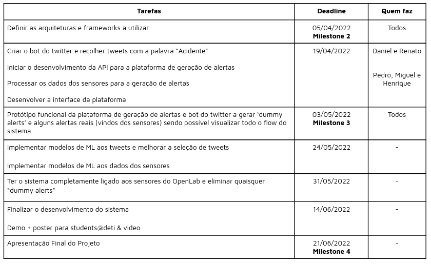

# Secured Roads

## What is Secured Roads

Secured Roads is a project that seeks to improve the safety of the city of Aveiro by providing authorities with information about the roads in real-time. It allerts them when someone has either broken the law or if there was an accident so there can be a fast response time. This is possible thanks to the support of Aveiro Open Lab and machine learning technology.

## How it works

To provide authorities with the road's state in real-time, Secured Roads utilises the Smart Lamp Post (SLP) created and built by Aveiro Open Lab to check the state of the roads. To do this, it uses the information provided by the radars of the SLP to conclude if there is a traffic jam. 

It can also notify them if someone has broken the law or if there has been an accident. It does this by utilising the radars and cameras provided by SLP as well as Twitter posts in conjunction with image and text recognition.

Thanks to all this, Secured Roads can make the roads of Aveiro just a bit safer.

## How to use

We plan to launch a webapp that will provide users with information of the state of the roads of Aveiro.

Sadly, Secured Roads is still in its early stages of development, therefore it still isn't fully operational.

We are expecting to have a working prototype by the end of June.
When said prototype is ready, we will provide the link here.

## Presentations

[1st Presentation](https://lazyprogramer.github.io/Secured_Roads/presentations/Milestone%201%20-%20Inception%20Phase.pdf)

[2st Presentation](https://lazyprogramer.github.io/Secured_Roads/presentations/Milestone%202%20-%20Elaboration%20Phase.pdf)

## Calendar

## Dev Team

### Architects
- Daniel Francisco
- Renato Dias

### Coordinators
- Henrique Sousa
- Pedro Figueiredo

### DevOps
- Miguel Monteiro

## Advisors

- Susana Sargento
- Pedro Rito
- Ana Almeida

## Repositories

#### FrontEnd

https://code.nap.av.it.pt/atcll/dev/atcll-frontend

#### BackEnd

https://code.nap.av.it.pt/atcll/dev/citymanager-backend/
